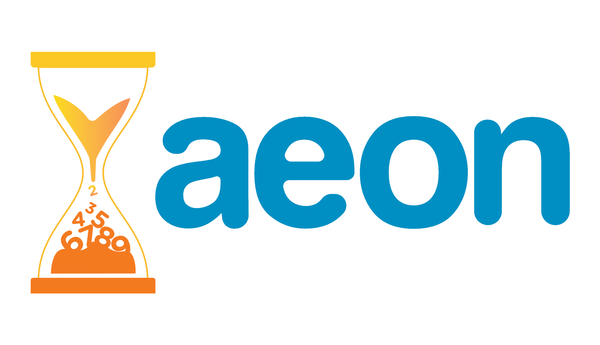

    

# Welcome to aeon

aeon release: v0.1.0

| Overview      |                                                                                                                                                                                                                                                                                                                                                                                                                                                                                                                                      |
|---------------|--------------------------------------------------------------------------------------------------------------------------------------------------------------------------------------------------------------------------------------------------------------------------------------------------------------------------------------------------------------------------------------------------------------------------------------------------------------------------------------------------------------------------------------|
| **CI/CD**     |    |
| **Code**      |                                                                                                                                                                                                                                                                                      |
| **Community** |                                        |

## Installation

## 💬 Where to ask questions

| Type                                | Platforms                        |
|-------------------------------------|----------------------------------|
| 🐛 **Bug Reports**                  | [GitHub Issue Tracker]           |
| ✨ **Feature Requests & Ideas**      | [GitHub Issue Tracker] & [Slack] |
| 💻 **Usage Questions**              | [GitHub Discussions] & [Slack]   |
| 💬 **General Discussion**           | [GitHub Discussions] & [Slack]   |
| 🏭 **Contribution & Development**   | [Slack]                          |

[GitHub Issue Tracker]: https://github.com/aeon-toolkit/aeon/issues
[GitHub Discussions]: https://github.com/aeon-toolkit/aeon/discussions
[Slack]: https://join.slack.com/t/aeon-toolkit/shared_invite/zt-1plkevy4x-vAg1dAUXcuoR38FjY9nxzg
