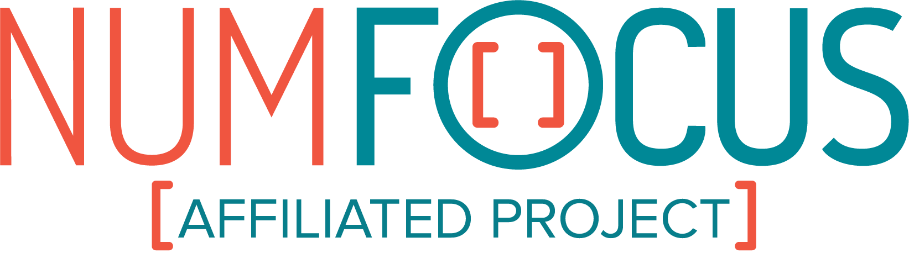

# About Us

## Roles

The roles are described in `aeon`'s [governance](governance.md) document.
A list of all contributors can be found [here](contributors.md).

### Code of Conduct Workgroup

The code of conduct workgroup maintains the code of conduct and handles any
issues related that arise.

```{include} about/code_of_conduct_workgroup.md
```

### Communications Workgroup

The communications workgroup manages the project's communication channels.

```{include} about/communications_workgroup.md
```

### Finance Workgroup

The finance workgroup is responsible for managing the project's finances.

```{include} about/finance_workgroup.md
```

### Infrastructure Workgroup

The infrastructure workgroup is responsible for managing the project's infrastructure
and CI.

```{include} about/infrastructure_workgroup.md
```

### Release Management Workgroup

The release management workgroup is responsible for managing the project's releases.

```{include} about/release_management_workgroup.md
```

### Core Developers

The core developers push forward `aeon`'s development and maintain the package.

```{include} about/core_developers.md
```

## Affiliation

`aeon` is an affiliated project of [NumFOCUS](https://numfocus.org/).

{w=300px}

## History

`aeon` was started in January 2023 as a fork of the `sktime` project by 8 core
developers using [v0.16.0](https://github.com/aeon-toolkit/aeon/releases/tag/sktime-v0.16.0)
as a base. In the following years, the project has grown to include many more core
developers, had a complete revamp of governance structure, and relaunched numerous
modules for time series learning tasks. `aeon` was accepted as a NumFOCUS affiliated
project in December 2023.

## Artwork

High quality PNG, JPG and EPS logos are available are located in the
[docs/images/logo/](https://github.com/aeon-toolkit/aeon/tree/main/docs/images/logo/)
directory on GitHub.

The logo was designed by [Reni Rahayu](https://www.instagram.com/kojodesignandco/) via
[crowdspring](https://www.crowdspring.com/).

## Funding

`aeon` is a community-driven project. However, institutional and private grants help to
ensure its sustainability.

The project developers would like to thank the following funders:

```{list-table}
:widths: 50 50
:header-rows: 1

* -
  -
* - The [UKRI Engineering and Physical Sciences Research Council (EPSRC)](https://gow.epsrc.ukri.org/NGBOViewGrant.aspx?GrantRef=EP/W030756/1) funds Matthew Middlehurst ({user}`matthewmiddlehurst`) and Tony Bagnall ({user}`TonyBagnall`) between 2022-2025
  - 
```

Short-term funding (<6 months) for internships has been provided by the following
organisations:

```{list-table}
:header-rows: 1

* - Name
  - GitHub ID
  - Organization
  - Year
* - Divya Tiwari
  - {user}`itsdivya1309`
  - [Google Summer of Code](https://summerofcode.withgoogle.com)
  - 2024
* - Aadya Chinubhai
  - {user}`aadya940`
  - [Google Summer of Code](https://summerofcode.withgoogle.com)
  - 2024
* - Gabriel Riegner
  - {user}`griegner`
  - [Google Summer of Code](https://summerofcode.withgoogle.com)
  - 2024
* - Ivan Knyazev
  - {user}`IRKnyazev`
  - [EPSRC](https://gow.epsrc.ukri.org/NGBOViewGrant.aspx?GrantRef=EP/W030756/1)
  - 2024
* - Daniele Carli
  - {user}`Moonzyyy`
  - [EPSRC](https://gow.epsrc.ukri.org/NGBOViewGrant.aspx?GrantRef=EP/W030756/1)
  - 2024
```

Google Summer of Code (GSoC) sponsored internships applied and contributed to `aeon`
projects via the shared NumFOCUS application for the program.

## Infrastructure

We would also like to thank [GitHub Actions](https://github.com/features/actions)
and [ReadtheDocs](https://readthedocs.org) for the free compute time on their servers
and documentation hosting.


## Pre-fork Acknowledgements

<details><summary>`sktime` v0.16.0 core developers</summary>
<p>

The following listed contributors were part of the `sktime` core developer team at some
point prior to the split of the project.

- {user}`abostrom`
- {user}`ayushmaanseth`
- {user}`goastler`
- {user}`hyang1996`
- {user}`james-large`
- {user}`jasonlines`
- {user}`matteogales`
- {user}`prockenschaub`
- {user}`sajaysurya`
- {user}`fkiraly`
- {user}`mloning`
- {user}`miraep8`
- {user}`rnkuhns`
- {user}`achieveordie`
- {user}`khrapovs`
- {user}`SveaMeyer13`
- {user}`lovkush-a`
- {user}`freddyaboulton`
- {user}`danbartl`
- {user}`big-o`

</p>
</details>

<details><summary>`sktime` v0.16.0 funders</summary>
<p>

As a fork of the `sktime` project, `aeon` has benefited from funding given to `sktime`
prior to the projects split. We would like to thank the funders from before the split.

```{list-table}
:widths: 50 50
:header-rows: 1

* -
  -
* - [The Alan Turing Institute](https://turing.ac.uk) funded three months of the initial development under the [UKRI Strategic Priorities Fund](https://gow.epsrc.ukri.org/NGBOViewGrant.aspx?GrantRef=EP/T001569/1).
  - 
* - Markus Löning’s ({user}`mloning`) contributions between 2019 and 2021 were supported by the [UKRI Economic and Social Research Council (ESRC)](https://esrc.ukri.org), the [Consumer Data Research Centre (CDRC)](https://www.cdrc.ac.uk), the Enrichment Scheme at the [The Alan Turing Institute](https://turing.ac.uk), and the JROST Rapid Response Fund, a community effort of [Invest in Open Infrastructure](https://investinopen.org).
  -   
* - Mercedes-Benz AG/Daimler AG donated 2500 EUR to support the maintenance and development of `sktime` in 2021, as part of their [FOSS program](https://opensource.mercedes-benz.com).
  - 
```

__Sprints__

The 2019 joint `sktime`/`MLJ` development sprint was hosted by
[UCL](https://www.ucl.ac.uk) and [The Alan Turing Institute](https://turing.ac.uk).
Some participants could attend thanks to the initial funding of the
[The Alan Turing Institute](https://turing.ac.uk).

__Internships__

[Google Summer of Code (GSoC)](https://summerofcode.withgoogle.com),
[Major League Hacking](https://mlh.io) and [Outreachy](https://www.outreachy.org)
have all sponsored `sktime` internships.

The [Wellcome Trust](https://wellcome.org) sponsored one `sktime` internship as part of
Outreachy.

```{list-table}
:header-rows: 1

* - Name
  - GitHub ID
  - Organization
  - Year
* - Katie Buchhorn
  - {user}`KatieBuc`
  - Google Summer of Code
  - 2022
* - Mirae Parker
  - {user}`miraep8`
  - Google Summer of Code
  - 2022
* - Shivansh Subramanian
  - {user}`AurumnPegasus`
  - Google Summer of Code
  - 2022
* - Guzal Bulatova
  - {user}`GuzalBulatova`
  - Outreachy
  - 2021
* - Svea Marie Meyer
  - {user}`SveaMeyer13`
  - Google Summer of Code via [INCF](https://www.incf.org)
  - 2021
```

</p>
</details>
